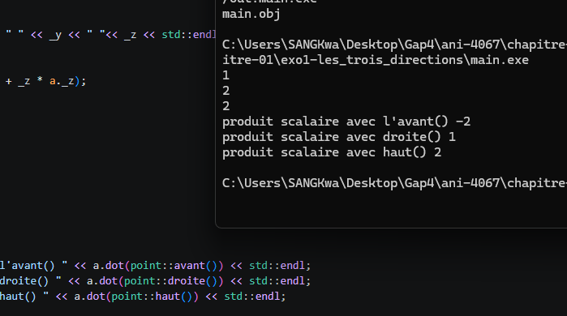

# Rapport

Nous avons opté pour gérer ce cas avec une classe, ce qui permet d'avoir une structure plus propre, rigide et propice aux ajouts ainsi qu'aux modifications. 
Pour déterminer les coordonnées Avant, Haut et Droite, nous avons utilisé la règle de la main droite, en sachant déjà que par convention, l'avant correspond à l'axe (-Z) :

- Paume de la main droite face au visage ;
- Tendre le pouce : il pointe vers la droite (+X) ;
- Tendre l'index vers le haut (+Y) ;
- Tendre le majeur vers le visage (+Z).

Cette méthode nous permet de déterminer les coordonnées axiales et les vecteurs unitaires des conventions OpenXR et Nkentseu.

Nous avons décidé de définir les fonctions Avant(), Haut() et Droite() en `static`, car celles-ci renverront toujours le même résultat quelle que soit l'instance de la classe créée. Il est donc plus judicieux qu'elles appartiennent à la classe plutôt qu'à l'objet.

Compilateur : MSVC

## Résultat
Comme le montre l'image ci-dessous :

