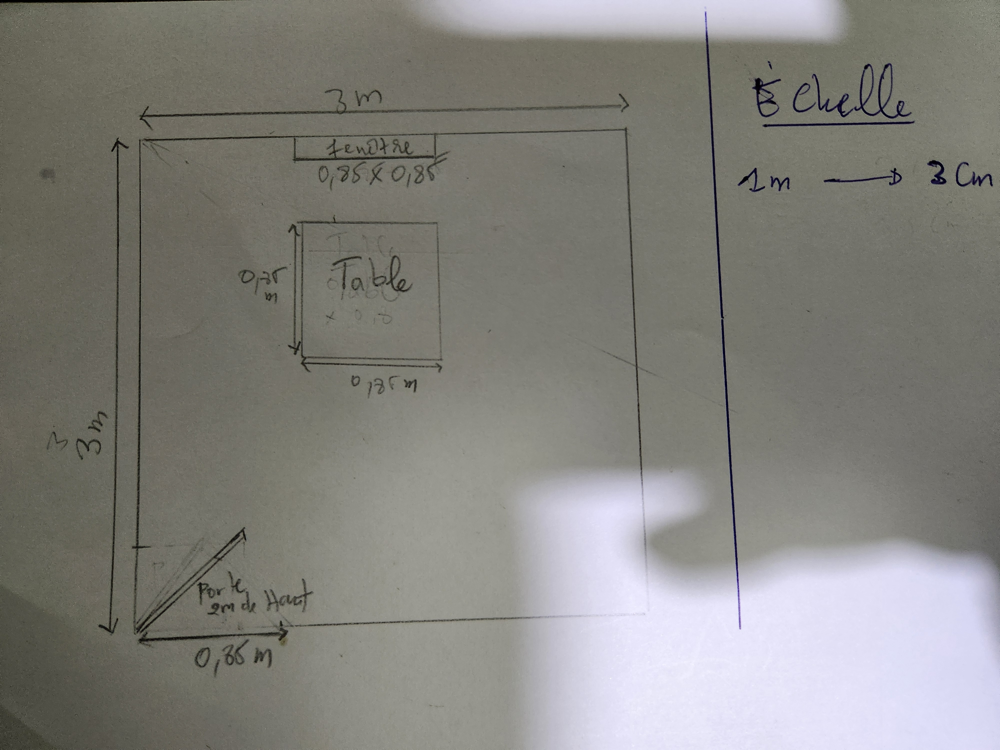

Voici la version corrigée :

# Description de la salle

Il s'agit ici d'une salle de dimension 3x3m avec ne fenetre sur un un mur de dimension 0.85m, avec une table un peu decalee vers l'arriere proche de la fenetre sur lesquels sera pose une station de travail (Ecran + Unite centrale) avec une console de jeu video(Playstation 5) et son casque compatible (PSVR2).
La porte en lui meme fait 2m de haut pour 0.85m de large pour pouvoir faire rentrer des choses dans la salle sans trop de soucis!

## Résultat
Comme le montre l'image ci-dessous :

