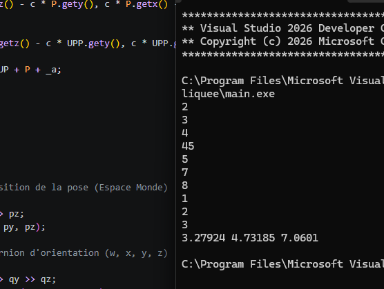

# Rapport

Nous avons opté pour gérer ce cas avec la classe `point` déjà conçue lors de l'exercice précédent. Nous l'avons simplement complétée avec des surcharges d'opérateurs. 
Nous avons également ajouté des structures (`quaternion` et `Pose`).

Pour le calcul de la pose, nous nous sommes servis de la formule donnée dans le chapitre. 
Maintenant, pour l'application du quaternion, nous avons utilisé la formule de rotation de Rodrigues :

$$\vec{P'} = \vec{P} + 2w (\vec{u} \times \vec{P}) + 2 (\vec{u} \times (\vec{u} \times \vec{P}))$$

Ce programme est vraiment à titre d'exemple ; il y a encore beaucoup d'optimisations à faire.

Compilateur : MSVC

## Résultat
Comme le montre l'image ci-dessous :

