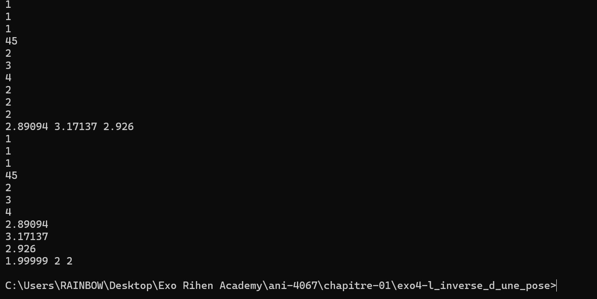

# Rapport

Nous avons écrit la fonction `inverser(Pose)`, méthode de notre structure `quaternion` qui s'appelle `_inversePose(point &P)`.
Le conjugué d'un quaternion est donné par $Q' = w - xi - yj - zk$.
Mathématiquement parlant, la pose inverse revient donc à (d'après l'énoncé) :

$\text{PoseInverse}(P) = Q'(P) + Q'(-p)$ (avec $p$ étant la position de la pose).

Or, étant donné que la rotation est une application linéaire, on peut donc encore écrire :

$\text{PoseInverse}(P) = Q'(P) - Q'(p)$

C'est la formule que nous avions choisie d'implémenter.

## Valeurs testées pour l'exercice :

**Test :**
* Position de la Pose : (1, 1, 1)
* Quaternion de la Pose : (45, 2, 3, 4)
* Point à tester : (2, 2, 2)

Ce programme est fourni à titre d'exemple ; de nombreuses optimisations restent à faire, notamment sur la gestion des cas limites, l'optimisation des opérations mathématiques, ou encore une meilleure surcharge des opérateurs (ces derniers ayant été implémentés de manière basique à des fins de test).

**Compilateur :** MinGW

---

## Résultats

* Pose normale : (2.89, 3.17, 2.92)
* Pose inverse après avoir appliqué la pose normale : (1.9999, 2, 2)
> *Observation : On retrouve le point $P$.*
* Écart entre $P$ et $P'$ ($P'$ étant le point transformé) : (0.0001, 0, 0)

## Conclusion

On peut donc conclure que pour n'importe quel point $x$ :

$\text{InversePose}(\text{Pose}(x)) = x$

### Observation en image
