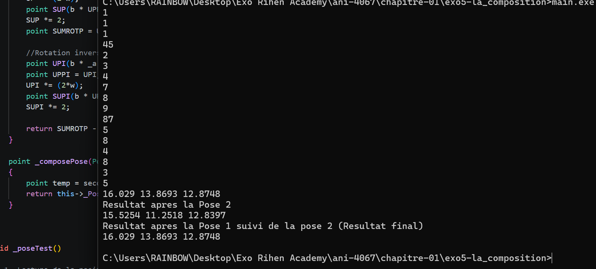

# Rapport

Nous avions écrit la fonction `_composePose(Pose &second, point &p)` qui permet de calculer la composition de deux poses distinctes.
Pour ce faire, étant donné que nous avions déjà écrit une fonction `_Pose`, il était juste question de l'appeler ici deux fois : une première fois sur la pose *second* et une seconde fois pour la pose qui appelle la fonction.

Ainsi, pour une composition de deux poses respectives $P$ et $Q$ sur un point $x$ :

$(P \circ Q)(x)$ sera matérialisé par `P._composePose(Q, x);`

## Valeurs testées pour l'exercice

**Test :**
* **Position de la Pose 1 :** (1, 1, 1)
* **Quaternion de la Pose 1 :** (45, 2, 3, 4)

* **Position de la Pose 2 :** (7, 8, 9)
* **Quaternion de la Pose 2 :** (87, 5, 8, 4)

* **Point à tester :** (8, 3, 5)

Ce programme est fourni à titre d'exemple ; de nombreuses optimisations restent à faire, notamment sur la gestion des cas limites, l'optimisation des opérations mathématiques, ou encore une meilleure surcharge des opérateurs (ces derniers ayant été implémentés de manière basique à des fins de test).

**Compilateur :** MinGW

---

## Résultats et preuve 

* **Composée :** (16.029, 13.8693, 12.8748)
* **Application d'une pose puis de l'autre sur un même point :** (16.029, 13.8693, 12.8748)

## Conclusion

Nous venons ainsi de démontrer que composer deux poses ou appliquer deux poses l'une après l'autre sur un même point $x$ donne le même résultat.

### Observation en image
