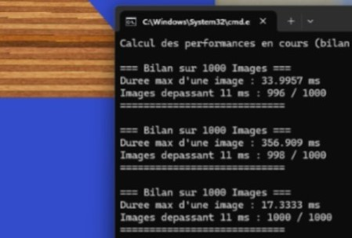

# Analyse et mesure de performance

Pour effectuer cette mesure de performance, nous avons utilisé notre mini moteur de rendu écrit lorsque nous étions en GAP3 et nous l'avons ajusté pour prendre les différentes mesures, notamment grâce à l'intelligence artificielle (Gemini) qui nous a permis d'effectuer cette modification sur le code !

## Lien du dépôt GitHub du moteur de rendu : https://github.com/JustSmoking/GAP3_Rendering_OpenGL_Prelude

Nous avons désactivé la synchronisation verticale avec glfwSwapInterval(0), car celui-ci synchronise les images générées avec le refresh rate de l'écran, ce qui biaise les performances. En effet, pour un écran de 60 Hz, la durée d'une image est de 16,66 ms, ce qui dépasse déjà les 11 ms.

# Méthodologie

On capture le temps actuel avec la fonction glfwGetTime(), puis on calcule le DeltaTime qui correspond au temps qu'il a fallu au PC pour fabriquer l'image. On exclut volontairement le temps de la première image, car il est quasiment toujours biaisé.

## Résultat
Comme le montre l'image ci-dessous :

- En moyenne, 998 images sur 1000 dépassent les 11 ms.
- La durée de la plus longue image pour la première itération est de 33,99 ms.

## Conséquence : Le constat est là, le programme n'est pas du tout adapté pour un casque VR. Pour un casque avec un refresh rate de 90 Hz, les images seront saccadées, avec des phénomènes de saut d'image qui causeront des effets néfastes à l'utilisateur.
