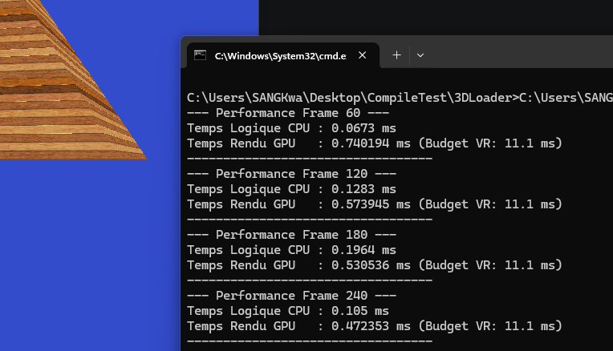

# Analyse et mesure de performance

Pour effectuer cette mesure de performance (Temps de rendu uniquement), nous avons utilisé notre mini moteur de rendu écrit lorsque nous étions en GAP3 et nous l'avons ajusté pour prendre les différentes mesures, notamment grâce à l'intelligence artificielle (Gemini) qui nous a permis d'effectuer cette modification sur le code

## Methodologie et Impact de Gemini

Pour commencer, le rendu (seul) concerne le GPU, donc pour le mesurer lance le chrono juste avant que l'ordre de dessiner soit envoyer par le CPU et on l'arrete juste apres ! Gemini nous a juste aidé dans l'implemantation de cette mesure, il aussi rajouté (sans mon intervention) une mesure du temps de la logique. Nous nous permettons d'utiliser l'IA car le but ici est de faire des constats!

## Lien du dépôt GitHub du moteur de rendu : https://github.com/JustSmoking/GAP3_Rendering_OpenGL_Prelude

la synchronisation verticale ici n'a pas d'impact sur le temps de renu car nous limitons a la mesure du temps déployé par le GPU pour dessiner l'image !

## Résultat
Comme le montre l'image ci-dessous :

- En moyenne, sur les 04 temps de rendu des images(60, 120, 180, 240) on obtient un temps de rendu : 0.56ms par image;
- Si on devait le faire 02 fois alors le temps de rendu serait de : 1.12ms;
- Pour un budget de 11.1ms pour 90FPS, il nous resterait : 9.98ms;

## Il faudrait reduire le temps de rendu car a lui seul il prends déja quasiment 1/10eme de  notre budget !