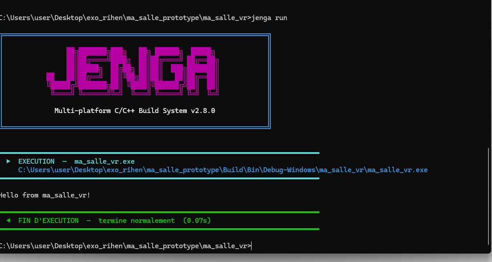

# Rapport
Nous avons créé un workspace qui s'appelle « ma_salle_proto ». Il contient un projet « ma_salle_vr », construit à l'aide du système de gestion de build Jenga, développé par la startup africaine Rihen et disponible sur leur dépôt GitHub !

* Toolchain : MinGW
* Plateforme : Windows, Android
* Architecture : x86_x64, arm64

## Retour et Output
Tout s'est bien deroulé et le projet build et run normalement !

