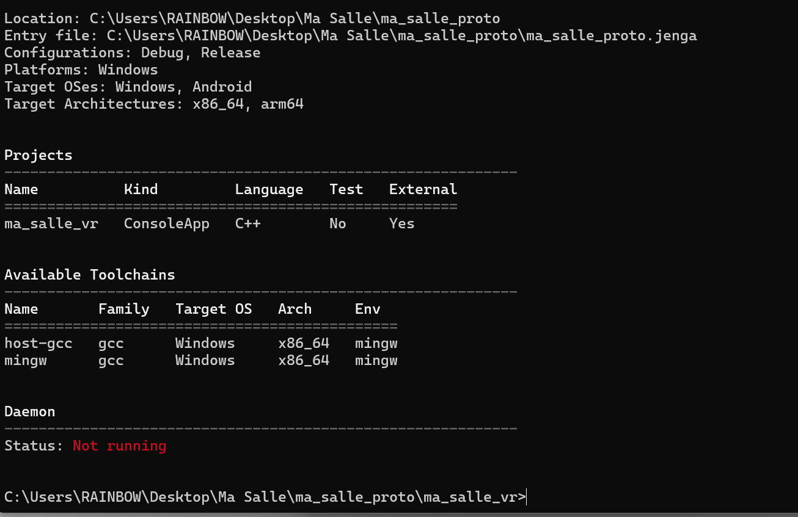

# Rapport

**OUTPUT** de la commande **jenga info** : 

* Toolchain : MinGW
* Plateforme-cible : Windows, Android
* Architecture-cible : x86_64, arm64
* Type d'application : console
* Plateforme-cible dont la toolchain disponible : windows uniquement pour le moment
* Test unitaire : Non

