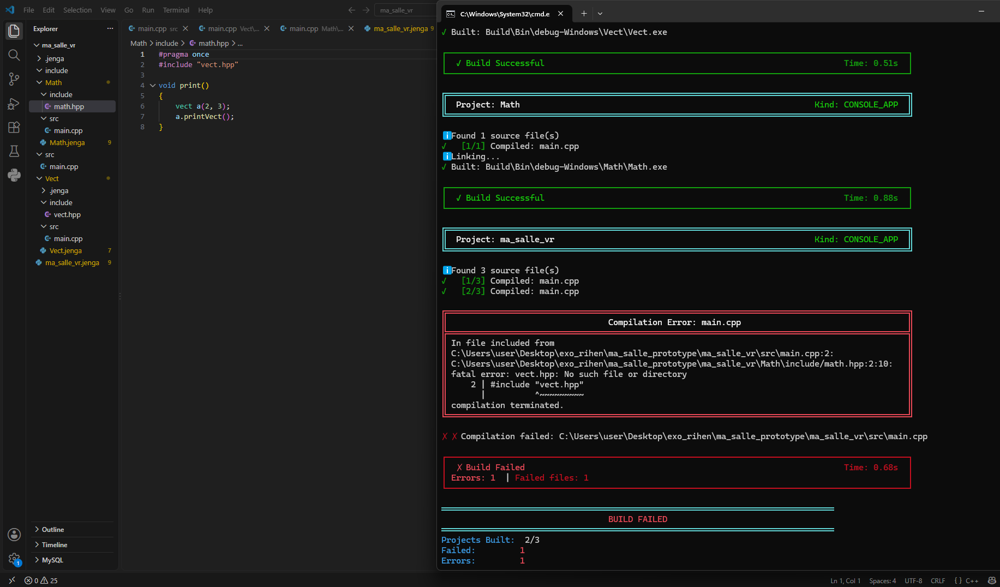

# Rapport de Build (`Jenga`)

## Description du Problème

Dans le cadre du projet, nous avons créé deux modules :
* **`Vect`** : Contient la représentation d'un vecteur 2D (`vect.hpp`).
* **`Math`** : Dépend du module `Vect`, permet de déclarer et d'afficher ce vecteur (`math.hpp`).

Dans le fichier de configuration `Math.Jenga`, la dépendance a été déclarée à l'aide des fonctions :
* `includedirs([])` : Indique l'emplacement des fichiers d'en-tête du module.
* `dependson([])` : Spécifie les dépendances directes afin de garantir un ordre de compilation correct.

---

## Observations & Symptômes

Lors de la compilation globale du projet :
1. Les modules **`Vect`** et **`Math`** se compilent correctement séparément.
2. Le **projet principal** échoue à la compilation lors du traitement de `main.cpp`.
3. Le préprocesseur indique qu'il ne trouve pas le fichier `vect.hpp`, alors que celui-ci est inclus dans `math.hpp` (qui lui-même est inclus dans `main.cpp`).

### Erreur de compilation (Log)
╔══════════════════════════════════════════════════════════════════════════════════════════════╗
║                                Compilation Error: main.cpp                                  ║
╠══════════════════════════════════════════════════════════════════════════════════════════════╣
║ In file included from                                                                        ║
║ C:\Users\user\Desktop\exo_rihen\ma_salle_prototype\ma_salle_vr\src\main.cpp:2:               ║
║ C:\Users\user\Desktop\exo_rihen\ma_salle_prototype\ma_salle_vr\Math\include/math.hpp:2:10:   ║
║ fatal error: vect.hpp: No such file or directory                                             ║
║     2 | #include "vect.hpp"                                                                  ║
║       |          ^~~~~~~~~~                                                                  ║
║ compilation terminated.                                                                      ║
╚══════════════════════════════════════════════════════════════════════════════════════════════╝

✗ ✗ Compilation failed: C:\Users\user\Desktop\exo_rihen\ma_salle_prototype\ma_salle_vr\src\main.cpp

┌──────────────────────────────────────────────────────────────────────────────────────────────┐
│  ✗ Build Failed                                                                 Time: 0.68s  │
│ Errors: 1  | Failed files: 1                                                                 │
└──────────────────────────────────────────────────────────────────────────────────────────────┘

════════════════════════════════════════════════════════════════════════════════
                                 BUILD FAILED
════════════════════════════════════════════════════════════════════════════════
Projects Built:  2/3
Failed:         1
Errors:         1
Time:           2.07s
Status:         ✗ FAILURE

C'est une erreur de preprocessing 

