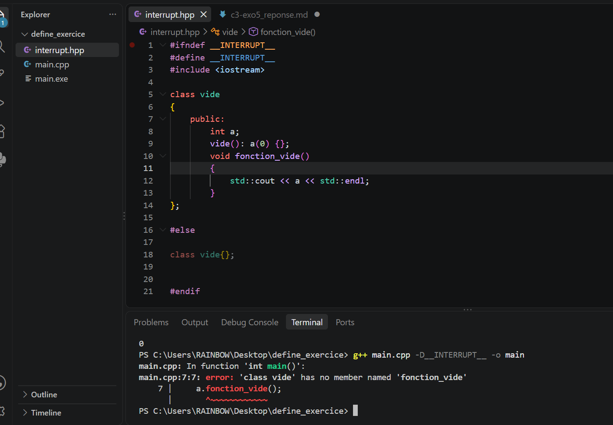

# Rapport 

Comme on peut le voir dans la capture plus bas, nous avions créé une classe qui renvoie une classe vide sans le define.

Nous utiliserons l'option de l'interrupteur **`-DMONINTERRUPTEUR`** pour activer et désactiver le define !
* **`Avec l'interrupteur activé`** : Avec l'interrupteur, nous avons une erreur qui dit `class vide has no member named 'fonction_vide'`, la partie où la classe est définie entièrement a été sautée.
* **`Sans l'interrupteur activé`** : Tout se passe normalement, et le programme renvoie ce qu'il doit renvoyer.

---

## Conclusion 

--- 

Honnêtement, le message d'erreur est prévisible puisque c'est dans la commande de compilation que l'on définit l'interrupteur, ainsi `#ifndef` renvoie faux et cela saute le premier bloc qui va retomber sur le `else` !

